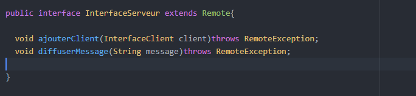
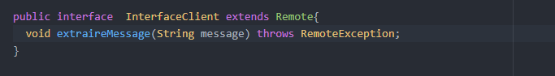

# APPLICATION CHAT JAVA RMI

Dans ce projet, nous allons créer un programme de discussion simple utilisant deux utilisateurs.

Un utilisateur discutera côté serveur, tandis que l'autre discutera côté client de l'application RMI.

### => Du côté serveur :  
     ~ Serveur ~ :
Tout d'abord , On crée une instance depuis le serveur.

Puis , on définie l'objet sous le nom de RMISC.

PS: en cas de besoin d'une instance il faut juste faire un appel au RMISCt.

     ~ Implementation du Serveur ~ :  
On commence, par avoir une liste de client qui seront dessus une fois ajouter. 

       ~ Interface du Serveur ~ :

 

### => Du côté client :
       ~ Client ~ :
Puisque q'on est sur le meme pc on definit "localhost" ou "127.0.0.1" c'est équivalent.

le lookup c'est une méthode qui va nous permettre de chercher le RMISC.

   

       ~ Implementation du Client ~ :  

 On aura besoin ici d'un constructeur afin qu'il puisse créer un client en lui definissant le nom du client et le nom du serveur.

   

 Puis on affiche et on lit le message de client.

    

      ~ Interface du client ~ :  

  

  ### Démonstration

  

 #  by Meryem Sghiri
